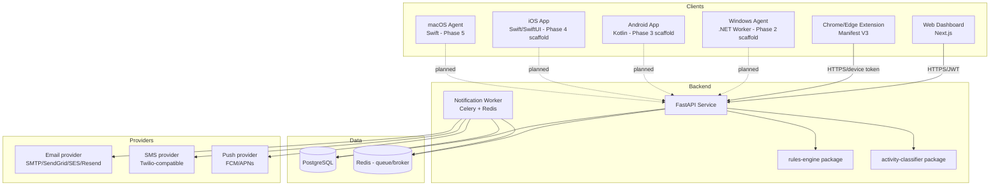
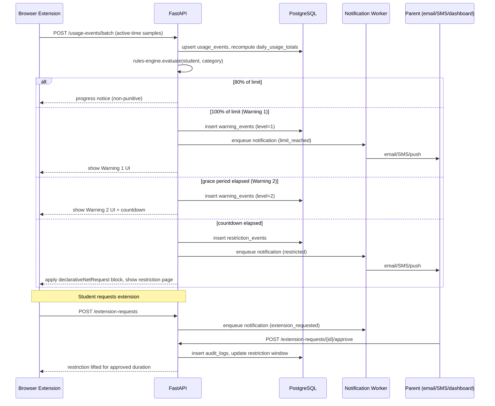

# FocusSentinel — Architecture

## System diagram



## Data flow — warning/restriction sequence



## Monorepo layout

```text
focussentinel/
  apps/
    web-dashboard/        # Next.js (implemented)
    browser-extension/    # Manifest V3 (implemented)
    android/              # Phase 3 scaffold + docs only
    ios/                  # Phase 4 scaffold + docs only
    windows-agent/        # Phase 2 scaffold + docs only
    macos-agent/          # Phase 5 scaffold + docs only
  services/
    api/                   # FastAPI (implemented)
    notification-worker/   # Celery worker (implemented)
  packages/
    shared-types/          # TS types shared by web + extension
    rules-engine/          # Python rules engine + simulated clock (implemented)
    activity-classifier/   # domain/app classification catalog (implemented)
  database/
    migrations/            # raw SQL migrations
    seed/                  # demo family/student/rules
  docs/
```

## Key architectural decisions

- **Rules engine is a standalone package**, not inline API logic, so it can be unit tested with a simulated clock (45-minute limits tested in seconds) and reused by future native agents without re-implementing the state machine.
- **Classification catalog is data-driven** (JSON-like Python/TS structures) so administrators can extend it without code changes, and so mobile/desktop agents (once built) share the same category definitions as the browser extension.
- **Device tokens are scoped narrowly**: a device can submit usage events and fetch its own rules, nothing else. Parent/student dashboard sessions use full JWT auth with RBAC.
- **Notifications go through adapters** (`services/notification-worker/app/adapters/`) so swapping SendGrid/Twilio/FCM for another vendor doesn't touch business logic, and secrets stay server-side only.
- **Offline-first browser/agent design**: usage events carry a client-generated idempotency key so re-sending queued events after reconnect cannot double count.
