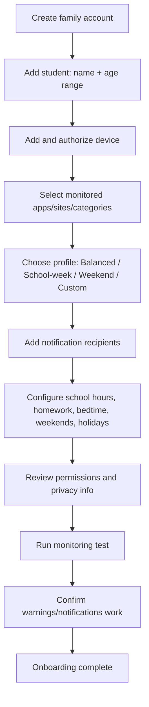

# FocusSentinel — Key User Flows

## Onboarding (parent)

Suggested profiles (all editable, all labeled as household settings, not medical guidance):

| Profile | Games | Short-form video | Notes |
|---|---|---|---|
| Balanced | 60 min/day | 30 min/day | Default starting point |
| School-week focus | 30 min/day (after homework window) | 15 min/day | Weekday only |
| Weekend flexibility | 120 min/day | 60 min/day | Sat/Sun only |
| Custom schedule | parent-defined | parent-defined | Built from scratch |

## Student experience contract

The student dashboard always shows, in plain language:

- What is being measured right now (app/site name + category)
- Time used today vs. the limit
- Time remaining before a warning
- A link to "What FocusSentinel measures and does not measure"

This is enforced in product copy, not just policy — see `apps/web-dashboard` student view and the extension popup.

## Warning → restriction → extension flow

See `docs/ARCHITECTURE.md` sequence diagram for the technical version. In plain language:

1. **80% notice** (informational, not a warning): "You have 10 minutes remaining for gaming today."
2. **Warning 1** (limit reached): on-screen warning, usage summary, "what happens next," Stop button, Request More Time button. Recipients notified.
3. **Warning 2** (grace period elapsed): stronger warning with visible countdown, explicit "save your progress" messaging.
4. **Restriction** (countdown elapsed): activity blocked, restriction screen shows reason + reset time + extension request button + parent PIN override where appropriate. Recipients notified. Event logged.
5. **Extension request**: student picks minutes/reason/explanation; parent approves a fixed increment, "until a time," or "rest of day," or denies with the decision logged to the audit trail.

Never restricted regardless of rules: emergency calling, safety-related device settings, school-required allowlisted apps, accessibility tools, parent/guardian communication channels.
